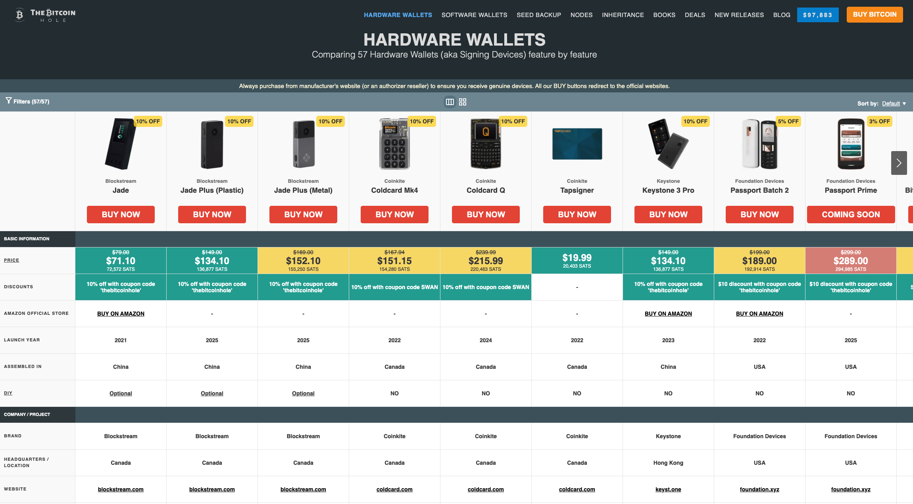

# The Bitcoin Hole - Database

This repository goal is to have the more complete database of Hardware Wallets, Software Wallets, Bitcoin Nodes, Seed Backup Solutions, Inheritance Services & Bitcoin Books features, so they can be compared, helping users to choose wisely. The database is open-source, meaning anyone can collaborate to improve and correct any wrong data or add new items.

* [Hardware Wallets](/item-types/hardware-wallets)
* [Software Wallets](/item-types/software-wallets)
* [Seed Backup Solutions](/item-types/seed-backup)
* [Inheritance Services](/item-types/inheritance)
* [Bitcoin Nodes](/item-types/bitcoin-nodes)
* [Bitcoin Books](/item-types/books)

All the info about the companies/projects owners of the any of the items, can be located at the [brands](/brands) directory.

## Website

The [thebitcoinhole.com](https://thebitcoinhole.com/) website offers Hardware Wallets, Software Wallets, Bitcoin Nodes, Seed Backup Solutions, Inheritance Services & Bitcoin Books comparisons using this database.

## Sponsor this project
Sponsor this project to help us get the funding we need to continue working on it.

* [Donate with Bitcoin Lightning](https://getalby.com/p/thebitcoinhole) ⚡️ [thebitcoinhole@getalby.com](https://getalby.com/p/thebitcoinhole)
* [Donate with PayPal or a credit card using Ko-fi](https://ko-fi.com/thebitcoinhole)
* [Donate on Patreon](https://www.patreon.com/TheBitcoinHole)

## Follow us
* [Twitter](http://x.com/thebitcoinhole)
* [Nostr](https://primal.net/p/npub1mtd7s63xd85ykv09p7y8wvg754jpsfpplxknh5xr0pu938zf86fqygqxas)
* [Medium](https://medium.com/the-bitcoin-hole)
* [GitHub](https://github.com/thebitcoinhole)
